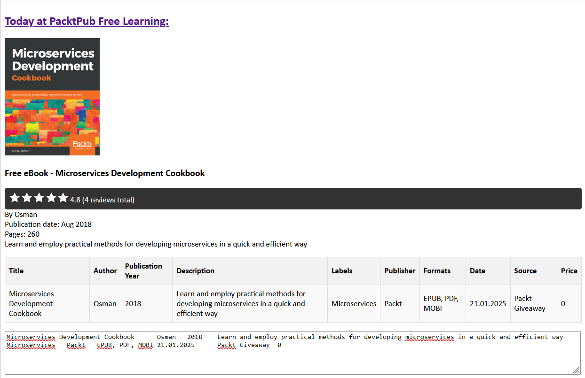

# PacktPub Free Learning Book Reminder

This project is designed to fetch the daily free learning book from PacktPub (https://www.packtpub.com/free-learning) and send a reminder email with the book details. The details are also presented in a table format to facilitate easy cataloging in your spreadsheet. They may include labels generated by an OpenAI model using the book info.

If no labels are needed, the OpenAI configuration can be omitted.

Example email:



## Project Structure

- **run_reminder.py**: The main script that orchestrates fetching the book details, generating labels, and sending the email.
- **labeler.py**: Contains the `Labeler` class, which uses the OpenAI API to generate labels for a book based on its title, author, and description.
- **email_body_builder.py**: Contains the `EmailBodyBuilder` class, which constructs the HTML body of the email using the book details and labels.
- **.github/workflows/run_reminder.yml**: GitHub Actions workflow file to automate the running of the reminder script.

## Local Setup

### Prerequisites

- Python 3.12 or later
- A Gmail account with an app password for sending emails
- An OpenAI API key (optional, for labels)

### Installation

1. Clone the repository:
   ```bash
   git clone https://github.com/Tar-Calion/packt-free-book-reminder.git
   cd packtpub-reminder
   ```

2. Create a virtual environment and activate it:
   ```bash
   python -m venv .venv
   source .venv/bin/activate  # On Windows use `venv\Scripts\activate`
   ```

3. Install the dependencies:
   ```bash
   pip install -r requirements.txt
   ```

4. Create a `.env` file in the root directory and add the following environment variables:
   ```plaintext
   GMAIL_USERNAME=your_gmail_username (email address)
   GMAIL_APP_PASSWORD=your_gmail_app_password
   RECIPIENT_EMAIL=recipient_email_address
   OPENAI_API_KEY=your_openai_api_key
   OPENAI_MODEL=your_openai_model_name ("gpt-4o-mini" recommended)
   ```

   Note: The OpenAI API key and model are optional and only needed if you want to generate labels.

### Running Locally

To run the script locally, execute the following command:

````bash
    python run_reminder.py
````

## GitHub Workflow

The project includes a GitHub Actions workflow defined in `.github/workflows/run_reminder.yml`. This workflow is triggered on a schedule (daily at 4 AM UTC), on pushes to the `main` branch, and on pull requests to the `main` branch.

### Environment Variables

The workflow uses the following secrets and variables:
- secret `GMAIL_USERNAME`: Your Gmail username.
- secret `GMAIL_APP_PASSWORD`: Your Gmail app password.
- secret `RECIPIENT_EMAIL`: The email address to send the reminder to.
- secret `OPENAI_API_KEY`: Your OpenAI API key.
- variable `OPENAI_MODEL`: The OpenAI model to use.

Ensure these are set in your GitHub repository's secrets and variables settings.

## Error handling

If an error occurs during the OpenAI API call, the email will still be sent, but without labels.

All errors are logged.

## License

This project is licensed under the Unlicence.